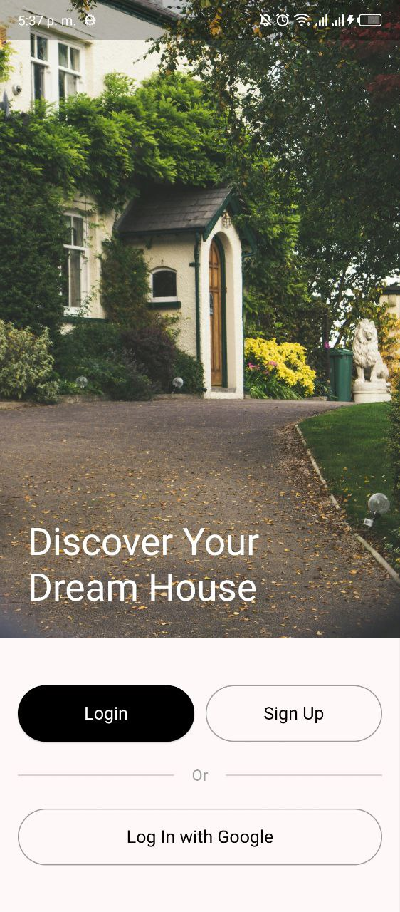
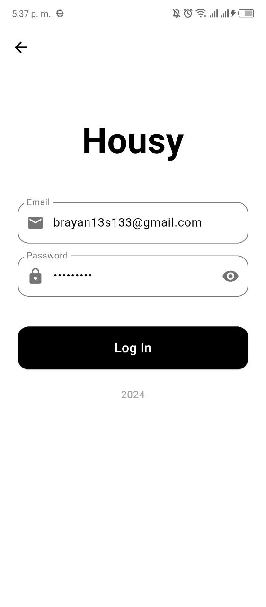
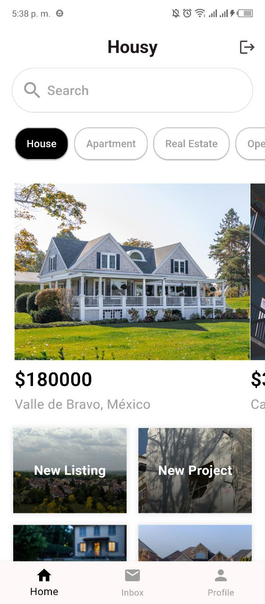

# Housy

This is a personal Flutter project named "Housy" where I'm experimenting and learning Flutter development. It's a playground for me to explore different features and functionalities of the framework.

## About

This project is purely for learning and personal development. I'm using it to:

- Practice building user interfaces with Flutter widgets.
- Authentication using Firebase and keep session auth into Flutter App
- Experiment with state management solutions.
- Explore different architectural patterns.
- Integrate third-party libraries.

## Disclaimer

This project is not intended for production use.

## Screenshots

